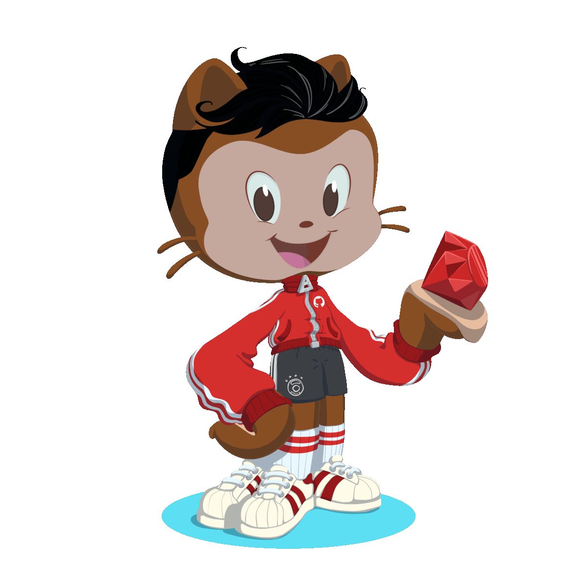

   <h1>
       </img>
       Hi, I'm Eduardo 👋
   </h1>  

I'm a software engineer who is passionate about developing new applications that are easy to use, beautiful to look at and fun to work with. I enjoy exploring new technologies to further elevate users while building a community. I enjoy working with Ruby, Rails, JavaScript, React, Redux and any new APIs I can get my hands on. Check out my projects and connect with me below.

## Highlights

- 📝I’m currently finishing a group project, [Scene][scene]
- 🌱 I’m looking forward to learning TypeScript and Python
- 😄 I'm proud of my Hipcamp clone, [Venture Camp][venturecamp]
- 📫 Looking to connect? Reach out on [LinkedIn][linkedin]
- ⚡ Fun facts:
   - 👟 Sneakers are a passion
   - 🐶 Obsessed with my doggo Marley
   - 🎮 Video games keep me young
   - 🏀 Ball is life
   - ✈ Travel is necessary

## My Languages and Tools

[scene]: https://scene-app.herokuapp.com/
[linkedin]: https://www.linkedin.com/in/eduardobacsierra/
[venturecamp]: https://venture-camp.herokuapp.com/

<!--
**bann-dito/bann-dito** is a ✨ _special_ ✨ repository because its `README.md` (this file) appears on your GitHub profile.

Here are some ideas to get you started:

- 🔭 I’m currently working on ...
- 🌱 I’m currently learning ...
- 👯 I’m looking to collaborate on ...
- 🤔 I’m looking for help with ...
- 💬 Ask me about ...
- 📫 How to reach me: ...
- 😄 Pronouns: ...
- ⚡ Fun fact: ...
-->
